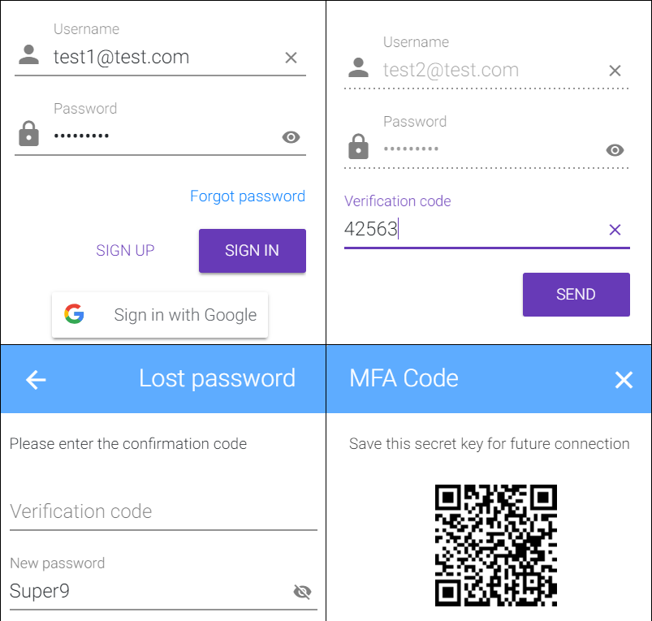

# Login Form Component
> Angular component providing login and password management using [Angular Material](https://material.angular.io) library.

<a href="https://nodei.co/npm/@caliatys/login-form/" target="_blank">
  
</a>



## Installation
Install `@caliatys/login-form` in your project:
```sh
npm install @caliatys/login-form --save
```

Import the `LoginFormModule` inside a `login.module.ts`:
```typescript
import { LoginFormModule } from '@caliatys/login-form';

@NgModule({
  imports: [
    LoginFormModule
  ],
})
export class LoginModule { }
```

Use the `cal-login-form` component inside a `login.component.html`:
```html
<cal-login-form #loginForm 
  (login)="login($event)" 
  (loginSocial)="loginSocial($event)" 
  (forgottenPass)="forgottenPassword($event)" 
  (sendFirstPass)="firstPassword($event)" 
  (sendResetPass)="lostPassword($event)">
</cal-login-form>
```

See the example in [src/app/app.component.ts](https://github.com/Caliatys/LoginComponent/blob/master/src/app/app.component.ts)

#### Inputs
```typescript
// Display forms inside a modal or a tab
@Input() customFormLayouts : any = {
  password : 'modal',
  mfaSetup : 'tab',
  mfa      : 'tab'
}
// Policies applied on the password field
@Input() customPolicies : any = {
  range : {
    min : 8,
    max : 128,
  },
  char   : true,
  number : true,
  lower  : true,
  upper  : true
}
// Social buttons displayed on the login form
@Input() customSocialButtons : any = {
  google   : true,
  facebook : true
}
// Dislay user icon inside login input
@Input() inputLoginWithIcon   : boolean = true;
// Display clear button on login input
@Input() inputLoginWithButton : boolean = true;
// Display lock icon inside password input
@Input() inputPassWithIcon    : boolean = true;
// Display show/hide button on password input
@Input() inputPassWithButton  : boolean = true;
// Labels of the login form
@Input() customLoginLabels : any = {
  loginLabel                 : 'Login',
  passwordLabel              : 'Password',
  forgottenPasswordLabel     : 'Forgotten password',
  signInLabel                : 'Sign in',
  googleSignInLabel          : 'Sign in with Google',
  facebookSignInLabel        : 'Sign in with Facebook',
  fieldRequiredLabel         : 'This field is required',
  fieldEmailLabel            : 'This value must be an email'
};
// Labels of the password form
@Input() customPassLabels : any = {
  verifCodeMessageLabel      : 'Please enter the confirmation code you will receive by email',
  verifCodeLabel             : 'Verification code',
  newPasswordLabel           : 'New password',
  sendLabel                  : 'Send',
  policyPassword1Label       : 'Minimum password length (6 to 128)',
  policyPassword2Label       : 'Require at least one uppercase letter (A to Z)',
  policyPassword3Label       : 'Require at least one lowercase letter (a to z)',
  policyPassword4Label       : 'Require at least one number (0 to 9)',
  policyPassword5Label       : 'Require at least one nonalphanumeric character ! @ # $ % ^ & * ( ) _ + - = [ ] { } | \'',
  fieldRequiredLabel         : 'This field is required',
  fieldNonWhitespaceLabel    : 'This value must not contain any spaces'
};
// Labels on top of the password form
@Input() customHeaderLabels : any = {
  mfaCodeLabel               : 'MFA Code',
  lostPasswordLabel          : 'Lost password',
  updatePasswordLabel        : 'Update password',
  updatePasswordMessageLabel : 'Please enter a new password',
};
// Labels of the mfa setup form
@Input() customMfaSetupLabels : any = {
  verifCodeLabel : 'Verification code',
  saveLabel      : 'Save',
  description    : 'Save this secret key for future connection'
}
// Labels of the mfa form
@Input() customMfaLabels : any = {
  verifCodeLabel : 'Verification code',
  sendLabel      : 'Send'
}
```

#### Outputs
```typescript
@Output() login         : EventEmitter<any>;
/* login    : string
*  password : string */
@Output() loginSocial   : EventEmitter<any>;
/* login    : string
*  password : string
*  social   : string */
@Output() forgottenPass : EventEmitter<any>;
/* login    : string
*  password : string */
@Output() sendFirstPass : EventEmitter<string>;
/* password : string */
@Output() sendResetPass : EventEmitter<string>;
/* password : string
*  code     : string */
@Output() saveMfaKey    : EventEmitter<string>;
/* code     : string */
@Output() sendMfaCode   : EventEmitter<string>;
/* code     : string */
```

**Important Note**: This project uses the following dependencies :
```json
"peerDependencies": {
  "@angular/common": "^6.0.0-rc.0 || ^6.0.0",
  "@angular/core": "^6.0.0-rc.0 || ^6.0.0",
  "@angular/material": "^6.0.0-rc.0 || ^6.0.0",
  "rxjs": "^6.0.0",
  "rxjs-compat": "^6.0.0",
  "bootstrap": "^4.0.0"
},
"optionalDependencies": {
  "angularx-qrcode": "^1.1.7"
}
```

## Roadmap

### In Progress
- Captcha
- Optional error messages
- Inline layout
- Show password button on Password setup field

### Planning
- Deploy with [Travis](https://travis-ci.org/) & Test Coverage with [Coveralls](https://coveralls.io/)
- Remove Bootstrap 4 dependency
- Sign up button
- Let you choose your verification pattern / regex (for login input)
- Update screenshot
- Fix Angular 6 Library assets
- Create an Online example with [StackBlitz](https://stackblitz.com)

### Contributions

Contributions are welcome, please open an issue and preferably submit a pull request.

For example, if we replace Bootstrap 4 classes by hand-made style we can reduce the amount of required dependencies.

## Development

This project was generated with [Angular CLI](https://github.com/angular/angular-cli) version 6.0.5.

### Development server

Run `ng serve` for a dev server. Navigate to `http://localhost:4200/`. The app will automatically reload if you change any of the source files.

### Code scaffolding

Run `ng generate component component-name` to generate a new component. You can also use `ng generate directive|pipe|service|class|guard|interface|enum|module`.

### Build

Run `ng build` to build the project. The build artifacts will be stored in the `dist/` directory. Use the `--prod` flag for a production build.

### Library Build / NPM Package

Run `npm run package` to build the library and generate an [NPM](https://www.npmjs.com) package.
The build artifacts will be stored in the `dist/lib` folder.

### Running unit tests

Run `ng test` to execute the unit tests via [Karma](https://karma-runner.github.io).

### Running end-to-end tests

Run `ng e2e` to execute the end-to-end tests via [Protractor](http://www.protractortest.org/).